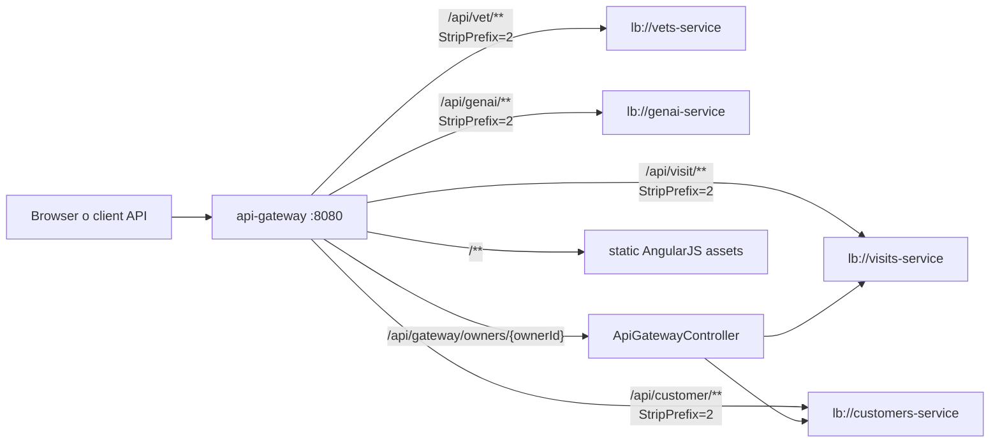
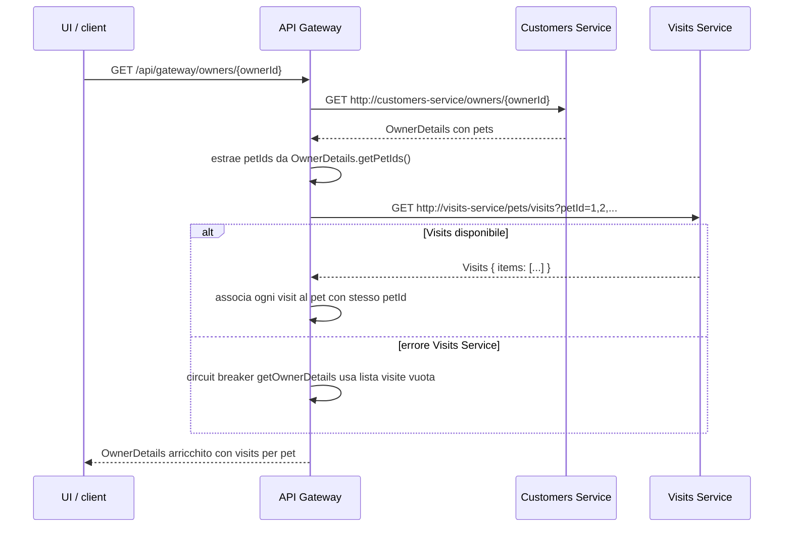

# Backend Architecture

Questo documento mappa il backend del repository Spring Petclinic Microservices usando endpoint, configurazioni e test presenti nel codice. L'obiettivo e' dare una guida pratica per successive feature backend, distinguendo cio' che esiste da cio' che e' opzionale o poco coperto.

## Mappa dei microservizi

| Modulo | Responsabilita' | Runtime principale |
| --- | --- | --- |
| `spring-petclinic-api-gateway` | Espone la UI AngularJS statica, instrada `/api/*` verso i microservizi con Spring Cloud Gateway e contiene l'endpoint aggregatore `GET /api/gateway/owners/{ownerId}`. | WebFlux, Spring Cloud Gateway, Eureka client, Resilience4j. |
| `spring-petclinic-customers-service` | Gestisce owners, pets e pet types. E' il servizio dati per anagrafiche clienti e animali. | Spring MVC, Spring Data JPA, Eureka client, HSQLDB di default. |
| `spring-petclinic-vets-service` | Espone la lista dei veterinari e delle specialita' collegate. | Spring MVC, Spring Data JPA, cache `vets`, Eureka client, HSQLDB di default. |
| `spring-petclinic-visits-service` | Gestisce visite per pet e la query bulk usata dal gateway per owner details. | Spring MVC, Spring Data JPA, Eureka client, HSQLDB di default. |
| `spring-petclinic-genai-service` | Espone la chat Spring AI, registra tool per owners/vets/pets e carica dati veterinari nel vector store. | Spring AI, WebFlux mode, Eureka client, OpenAI di default; Azure OpenAI configurabile. |
| `spring-petclinic-config-server` | Fornisce configurazione centralizzata da `spring-petclinic-microservices-config` o da filesystem con profilo `native`. | Spring Cloud Config Server, porta `8888`. |
| `spring-petclinic-discovery-server` | Registry Eureka usato da gateway, client load-balanced e GenAI. | Eureka Server, porta `8761`. |
| `spring-petclinic-admin-server` | Supporto osservabilita'/admin, non parte dei flussi funzionali core documentati qui. | Spring Boot Admin, opzionale. |

## Routing dell'API Gateway

Configurazione verificata in `spring-petclinic-api-gateway/src/main/resources/application.yml`.



Il gateway applica di default un `CircuitBreaker` con `fallbackUri: forward:/fallback` e un `Retry` per richieste `POST` con `SERVICE_UNAVAILABLE`. La route GenAI aggiunge anche `CircuitBreaker=name=genaiCircuitBreaker,fallbackUri=/fallback`. Il controller fallback espone `POST /fallback` e restituisce `503` con il testo `Chat is currently unavailable. Please try again later.`; non va quindi presentato come fallback generico production-ready per ogni metodo HTTP.

## Endpoint principali

Le route `/api/vet/**`, `/api/visit/**`, `/api/customer/**` e `/api/genai/**` rimuovono i primi due segmenti del path. Per esempio, `GET /api/customer/owners` arriva al Customers Service come `GET /owners`.

### API Gateway

| Endpoint | Destinazione o comportamento |
| --- | --- |
| `GET /api/gateway/owners/{ownerId}` | Aggrega owner e visite tramite `CustomersServiceClient` e `VisitsServiceClient`. |
| `POST /fallback` | Fallback locale testuale per chat/circuit breaker, status `503`. |
| `/api/vet/**` | Route load-balanced verso `vets-service`. |
| `/api/visit/**` | Route load-balanced verso `visits-service`. |
| `/api/customer/**` | Route load-balanced verso `customers-service`. |
| `/api/genai/**` | Route load-balanced verso `genai-service`. |

### Customers Service

| Endpoint interno | Endpoint via gateway | Note |
| --- | --- | --- |
| `GET /owners` | `GET /api/customer/owners` | Lista tutti gli owners. Non ci sono filtri nel codice attuale. |
| `POST /owners` | `POST /api/customer/owners` | Crea owner, status `201`. |
| `GET /owners/{ownerId}` | `GET /api/customer/owners/{ownerId}` | Ritorna `Optional<Owner>`. |
| `PUT /owners/{ownerId}` | `PUT /api/customer/owners/{ownerId}` | Aggiorna owner, status `204`; usa `ResourceNotFoundException` se assente. |
| `GET /petTypes` | `GET /api/customer/petTypes` | Lista tipi di pet. |
| `POST /owners/{ownerId}/pets` | `POST /api/customer/owners/{ownerId}/pets` | Crea pet per owner, status `201`. |
| `PUT /owners/*/pets/{petId}` | `PUT /api/customer/owners/*/pets/{petId}` | Aggiorna pet usando l'id nel body `PetRequest`. |
| `GET /owners/*/pets/{petId}` | `GET /api/customer/owners/*/pets/{petId}` | Ritorna `PetDetails`. |

### Vets Service

| Endpoint interno | Endpoint via gateway | Note |
| --- | --- | --- |
| `GET /vets` | `GET /api/vet/vets` | Lista tutti i veterinari; risultato cacheato con cache `vets`. Non ci sono filtri nel controller attuale. |

### Visits Service

| Endpoint interno | Endpoint via gateway | Note |
| --- | --- | --- |
| `POST /owners/*/pets/{petId}/visits` | `POST /api/visit/owners/*/pets/{petId}/visits` | Crea visita per pet, status `201`. |
| `GET /owners/*/pets/{petId}/visits` | `GET /api/visit/owners/*/pets/{petId}/visits` | Lista visite di un pet. |
| `GET /pets/visits?petId=111,222` | `GET /api/visit/pets/visits?petId=111,222` | Query bulk usata dal gateway; ritorna `{ "items": [...] }`. |

### GenAI Service

| Endpoint interno | Endpoint via gateway | Note |
| --- | --- | --- |
| `POST /chatclient` | `POST /api/genai/chatclient` | Invia il testo utente al `ChatClient`. In caso di eccezione ritorna testo fallback, non un contratto errore JSON. |

Il servizio GenAI contiene tool Spring AI per:

- leggere tutti gli owners da Customers Service (`GET /owners`);
- creare owner (`POST /owners`);
- creare pet per owner (`POST /owners/{ownerId}/pets`);
- cercare veterinari nel `VectorStore`.

Il caricamento del `VectorStore` avviene allo startup: se `vectorstore.json` esiste in classpath viene caricato; altrimenti il servizio chiama `http://vets-service/vets`, crea documenti dai veterinari e puo' salvare un file temporaneo. Non sono presenti tool GenAI diretti verso Visits Service nel codice attuale.

## Aggregazione owner details

Endpoint verificato in `ApiGatewayController`: `GET /api/gateway/owners/{ownerId}`.



Comportamento importante: il fallback copre la chiamata a Visits Service e lascia l'owner disponibile con visite vuote. La chiamata a Customers Service non ha fallback locale nello stesso controller: se l'owner non viene recuperato, l'aggregazione non puo' procedere.

## Dipendenze runtime

- **Config Server**: tutti i servizi applicativi importano `optional:configserver:${CONFIG_SERVER_URL:http://localhost:8888/}`; nel profilo `docker` l'import diventa `configserver:http://config-server:8888`. Il README lo considera prerequisito nel flusso locale normale.
- **Discovery Server**: i servizi sono Eureka client e il gateway usa URI `lb://...`. Senza Discovery Server le route load-balanced e alcuni client interni non risolvono i servizi nel flusso standard.
- **HSQLDB**: database in memoria di default per Customers, Vets e Visits, con script `src/main/resources/db/hsqldb/{schema,data}.sql`. I test dei tre servizi usano profilo `test`, disabilitano Config/Eureka e caricano gli script HSQLDB.
- **MySQL opzionale**: Customers, Vets e Visits includono `mysql-connector-j` e script `src/main/resources/db/mysql/{schema,data}.sql`. L'uso richiede il profilo `mysql` e configurazione coerente dal Config Server; non e' il default locale.
- **OpenAI / Azure OpenAI opzionale**: GenAI usa `spring-ai-starter-model-openai` nel `pom.xml`. `OPENAI_API_KEY` ha default `demo` in `application.yml`; Azure OpenAI e' configurato tramite `AZURE_OPENAI_KEY` e `AZURE_OPENAI_ENDPOINT` se si abilita lo starter Azure indicato nel README. Questi provider sono necessari per validare realmente la chat LLM-backed.
- **Docker Compose**: espone Config `8888`, Discovery `8761`, Gateway `8080`, Customers `8081`, Visits `8082`, Vets `8083`, GenAI `8084`. Zipkin, Admin Server, Grafana e Prometheus sono componenti di supporto/observability.

## Test backend esistenti

| Modulo | Test presenti | Cosa coprono |
| --- | --- | --- |
| `spring-petclinic-api-gateway` | `ApiGatewayControllerTest`, `VisitsServiceClientIntegrationTest`, `ApiGatewayApplicationTests` | Aggregazione owner details, fallback visite vuote su errore Visits, client Visits con `MockWebServer`, context load. |
| `spring-petclinic-customers-service` | `PetResourceTest` | `GET /owners/{ownerId}/pets/{petId}` in JSON. Non c'e' un test dedicato a `OwnerResource`. |
| `spring-petclinic-vets-service` | `VetResourceTest` | `GET /vets`. |
| `spring-petclinic-visits-service` | `VisitResourceTest` | `GET /pets/visits?petId=111,222` e struttura `{ items: [...] }`. |
| `spring-petclinic-config-server` | `PetclinicConfigServerApplicationTests` | Context load del Config Server. |
| `spring-petclinic-discovery-server` | `DiscoveryServerApplicationTests` | Context load del Discovery Server. |
| `spring-petclinic-genai-service` | Nessun test Java in `src/test/java` al momento. | La chat e i tool GenAI richiedono copertura futura se diventano flussi critici. |

Comandi utili:

```bash
./mvnw test
./mvnw -pl spring-petclinic-api-gateway test
./mvnw -pl spring-petclinic-customers-service test
./mvnw -pl spring-petclinic-vets-service test
./mvnw -pl spring-petclinic-visits-service test
./mvnw -pl spring-petclinic-config-server test
./mvnw -pl spring-petclinic-discovery-server test
```

Per una modifica documentale come questa, la validazione minima sensata e' statica: controllare controller, `application.yml`, `pom.xml`, `docker-compose.yml`, script DB e test esistenti. I comandi Maven sopra vanno usati quando una feature modifica comportamento backend.

## Gap e cautele operative

- `OwnerResource` non ha test dedicati nonostante esponga create/read/list/update owner.
- `GenAI Service` non ha test backend nel repository e dipende da provider LLM o fallback; non va trattato come flusso production-ready senza test e credenziali reali.
- I filtri su owners e vets non esistono negli endpoint attuali.
- Il fallback del gateway e della chat e' testuale e minimale; non definisce un payload errore comune.
- L'aggregatore owner details degrada solo quando fallisce Visits Service. Non degrada se Customers Service non risponde.
- MySQL e provider AI sono opzionali e richiedono configurazione esterna; il default documentato per sviluppo resta HSQLDB.
