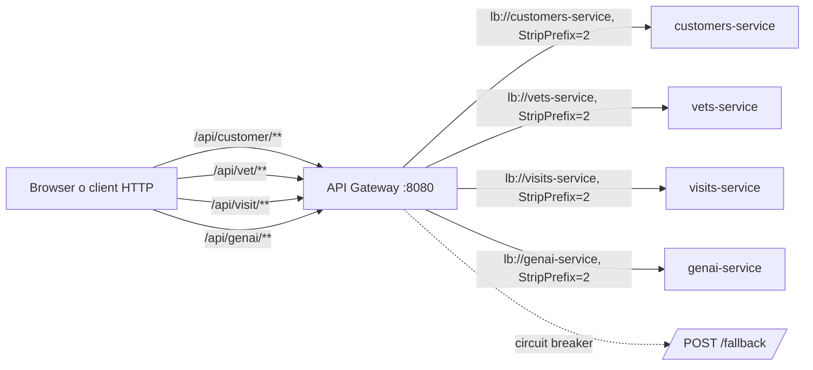
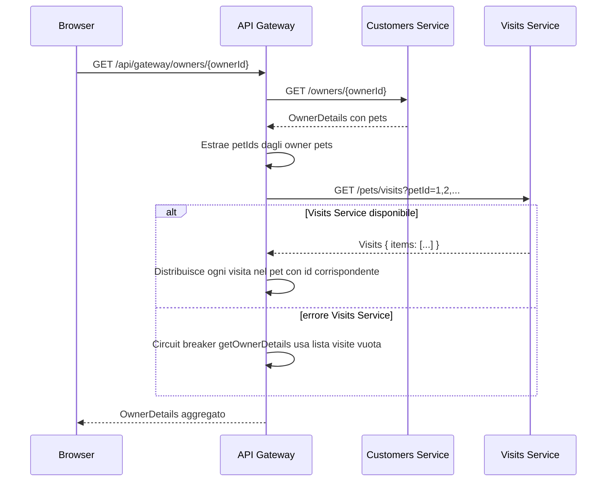

# Backend Architecture

Questo documento mappa il backend di Spring PetClinic Microservices a partire dal codice e dalla configurazione presenti nel repository. Il gateway serve anche il frontend AngularJS legacy, ma qui sono documentati solo i flussi backend e le API consumate dal frontend.

## Moduli e responsabilita

| Modulo | Ruolo | Responsabilita principali |
| --- | --- | --- |
| `spring-petclinic-api-gateway` | API Gateway e aggregatore | Espone il frontend statico, instrada `/api/vet/**`, `/api/visit/**`, `/api/customer/**` e `/api/genai/**` verso i servizi registrati in Eureka, espone l'endpoint aggregato `/api/gateway/owners/{ownerId}`. |
| `spring-petclinic-customers-service` | Customers Service | Gestisce owners, pets e pet types con persistence JPA. Usa HSQLDB di default e MySQL come profilo opzionale. |
| `spring-petclinic-vets-service` | Vets Service | Espone la lista veterinari e relative specialita. La lista e' cacheable con cache `vets`. |
| `spring-petclinic-visits-service` | Visits Service | Gestisce le visite per pet e fornisce una query aggregata per piu' pet usata dal gateway. |
| `spring-petclinic-genai-service` | GenAI Service | Espone la chat AI e inizializza una vector store con dati dei veterinari. Dipende da OpenAI di default, oppure Azure OpenAI se il POM viene modificato. |
| `spring-petclinic-config-server` | Support service | Spring Cloud Config Server sulla porta `8888`; usa il repository Git remoto di configurazione o il profilo `native` con `GIT_REPO`. |
| `spring-petclinic-discovery-server` | Support service | Eureka Server sulla porta `8761`; abilita service discovery e load-balanced URI `lb://...`. |
| `spring-petclinic-admin-server` | Support opzionale | Spring Boot Admin, non richiesto per i flussi applicativi core. |

## Routing dell'API Gateway

Le route sono definite in `spring-petclinic-api-gateway/src/main/resources/application.yml`. Ogni route usa Eureka (`lb://...`) e `StripPrefix=2`, quindi il prefisso pubblico `/api/<area>` viene rimosso prima di raggiungere il servizio.



Esempi di riscrittura:

| URL pubblico | Route | URL effettivo sul servizio |
| --- | --- | --- |
| `GET /api/customer/owners` | `customers-service` | `GET /owners` |
| `GET /api/customer/owners/{ownerId}` | `customers-service` | `GET /owners/{ownerId}` |
| `GET /api/customer/petTypes` | `customers-service` | `GET /petTypes` |
| `GET /api/customer/owners/{ownerId}/pets/{petId}` | `customers-service` | `GET /owners/{ownerId}/pets/{petId}` |
| `POST /api/customer/owners/{ownerId}/pets` | `customers-service` | `POST /owners/{ownerId}/pets` |
| `PUT /api/customer/owners/{ownerId}/pets/{petId}` | `customers-service` | `PUT /owners/{ownerId}/pets/{petId}` |
| `GET /api/vet/vets` | `vets-service` | `GET /vets` |
| `GET /api/visit/owners/{ownerId}/pets/{petId}/visits` | `visits-service` | `GET /owners/{ownerId}/pets/{petId}/visits` |
| `POST /api/visit/owners/{ownerId}/pets/{petId}/visits` | `visits-service` | `POST /owners/{ownerId}/pets/{petId}/visits` |
| `POST /api/genai/chatclient` | `genai-service` | `POST /chatclient` |

La route GenAI ha anche un circuit breaker dedicato `genaiCircuitBreaker`; il gateway definisce inoltre un circuit breaker di default e un retry di una volta per richieste `POST` con status `SERVICE_UNAVAILABLE`.

## Endpoint backend principali

Gli endpoint sotto sono stati verificati nei controller Java o nella configurazione del gateway.

| Servizio | Endpoint | Scopo |
| --- | --- | --- |
| API Gateway | `GET /api/gateway/owners/{ownerId}` | Aggrega owner e pets da Customers Service con visite da Visits Service. |
| API Gateway | `POST /fallback` | Fallback testuale per circuit breaker; oggi e' mappato come `POST`, quindi non copre chiamate `GET`. |
| Customers | `GET /owners` | Lista completa owners. Non ci sono filtri lato backend. |
| Customers | `POST /owners` | Crea un owner. |
| Customers | `GET /owners/{ownerId}` | Legge un owner per id. Il controller ritorna `Optional<Owner>`. |
| Customers | `PUT /owners/{ownerId}` | Aggiorna un owner o solleva `ResourceNotFoundException`. |
| Customers | `GET /petTypes` | Lista tipi pet. |
| Customers | `GET /owners/*/pets/{petId}` | Dettaglio pet. Il segmento owner e' wildcard e non viene validato contro il pet. |
| Customers | `POST /owners/{ownerId}/pets` | Crea un pet sotto un owner esistente. |
| Customers | `PUT /owners/*/pets/{petId}` | Aggiorna un pet. Il body `PetRequest.id()` guida il lookup. |
| Vets | `GET /vets` | Lista veterinari. |
| Visits | `GET /owners/*/pets/{petId}/visits` | Lista visite per singolo pet. |
| Visits | `POST /owners/*/pets/{petId}/visits` | Crea una visita per pet. |
| Visits | `GET /pets/visits?petId=1,2` | Lista visite per piu' pet, wrappata come `{ "items": [...] }`; usata dall'aggregazione gateway. |
| GenAI | `POST /chatclient` | Invia una query testuale al `ChatClient` Spring AI e ritorna testo. |

Gap da tenere presenti:

- Gli endpoint con `owners/*` non verificano che l'owner nel path corrisponda al pet o alle visite.
- `OwnerResource.findOwner` restituisce `Optional<Owner>`; il comportamento per id inesistente non e' modellato come contratto errore esplicito nel controller.
- La chat GenAI cattura eccezioni e ritorna una stringa di fallback, non un payload errore strutturato.
- La vector store GenAI carica `vectorstore.json` dal classpath se esiste; se il file viene rimosso tenta di interrogare `vets-service` a startup e puo' consumare crediti AI.

## Aggregazione Owner Details

`ApiGatewayController.getOwnerDetails` non passa dalla route gateway verso Customers/Visits, ma usa due client `WebClient` load-balanced con host logici `http://customers-service` e `http://visits-service`.



Il fallback copre solo errori nella chiamata a Visits Service: se Customers Service fallisce o non trova l'owner, l'endpoint aggregato non costruisce una risposta alternativa.

## Dipendenze runtime

### Config Server

Ogni servizio applicativo importa `optional:configserver:${CONFIG_SERVER_URL:http://localhost:8888/}`. Nel profilo `docker`, l'import diventa `configserver:http://config-server:8888` e non e' opzionale. Il Config Server usa per default `https://github.com/spring-petclinic/spring-petclinic-microservices-config`, oppure il backend filesystem con profilo `native` e variabile `GIT_REPO`.

### Discovery Server

Il Discovery Server espone Eureka su `8761`. Gateway, Customers, Vets, Visits, GenAI e Admin includono client Eureka; il gateway usa le route `lb://customers-service`, `lb://vets-service`, `lb://visits-service` e `lb://genai-service`.

### Database

Customers, Vets e Visits includono HSQLDB e MySQL Connector/J. Il flusso locale documentato nel README usa HSQLDB in memoria e inizializza schema/dati da `src/main/resources/db/hsqldb/{schema,data}.sql`. MySQL e' opzionale: si abilita con profilo Spring `mysql` sui tre servizi dati e richiede un database PetClinic esterno piu' configurazione coerente dal Config Server.

GenAI include anch'esso dipendenze HSQLDB/MySQL, ma il flusso principale del codice qui presente riguarda chat, tools e vector store; non va trattato come persistence production-ready senza ulteriore verifica.

### OpenAI e Azure OpenAI

`spring-petclinic-genai-service` dipende dal modulo Spring AI OpenAI nel POM:

- OpenAI e' il provider abilitato nel POM (`spring-ai-starter-model-openai`).
- Azure OpenAI e' presente come alternativa commentata e richiede modifica del POM a `spring-ai-starter-model-azure-openai`.
- `OPENAI_API_KEY` ha default `demo` in `application.yml`; Azure richiede `AZURE_OPENAI_KEY` e `AZURE_OPENAI_ENDPOINT`.

Questa integrazione e' opzionale per i flussi backend core. Senza credenziali o provider disponibile, la chat puo' rispondere con fallback testuale.

### Porte locali

`scripts/run_all.sh` avvia i jar su porte esplicite:

| Servizio | Porta |
| --- | --- |
| Config Server | `8888` |
| Discovery Server | `8761` |
| Customers Service | `8081` |
| Visits Service | `8082` |
| Vets Service | `8083` |
| GenAI Service | `8084` |
| API Gateway | `8080` |
| Admin Server | `9090` |

Con avvio IDE o `spring-boot:run`, il README indica Customers, Vets, Visits e GenAI su porta random registrata in Eureka, mentre il gateway resta il punto di ingresso frontend/API.

## Flussi principali

### Lista owners

1. Il frontend chiama `GET /api/customer/owners`.
2. Gateway applica route `customers-service` e rimuove `/api/customer`.
3. Customers Service riceve `GET /owners` e ritorna `ownerRepository.findAll()`.

### Dettaglio owner aggregato

1. Il frontend chiama `GET /api/gateway/owners/{ownerId}`.
2. Il gateway legge l'owner da Customers Service con `GET /owners/{ownerId}`.
3. Il gateway legge le visite da Visits Service con `GET /pets/visits?petId=<ids>`.
4. Il gateway aggiunge le visite ai pet corrispondenti nel DTO `OwnerDetails`.
5. Se Visits Service fallisce, il circuit breaker ritorna owner e pet senza visite.

### Lista veterinari

1. Il frontend chiama `GET /api/vet/vets`.
2. Gateway inoltra a `GET /vets`.
3. Vets Service ritorna `vetRepository.findAll()` con cache `vets`.

### Creazione visita

1. Il frontend chiama `POST /api/visit/owners/{ownerId}/pets/{petId}/visits`.
2. Gateway inoltra a Visits Service come `POST /owners/{ownerId}/pets/{petId}/visits`.
3. Visits Service imposta `visit.petId` dal path e salva con `visitRepository.save(visit)`.

### Chat GenAI

1. Il widget chat chiama `POST /api/genai/chatclient` con body JSON stringificato.
2. Gateway inoltra a `POST /chatclient`.
3. GenAI Service passa il testo al `ChatClient` Spring AI con tools PetClinic.
4. In caso di eccezione il servizio ritorna `"Chat is currently unavailable. Please try again later."`.

## Test backend esistenti

| Modulo | Test presenti | Cosa coprono |
| --- | --- | --- |
| `spring-petclinic-api-gateway` | `ApiGatewayApplicationTests`, `ApiGatewayControllerTest`, `VisitsServiceClientIntegrationTest` | Boot context, aggregazione owner details, fallback Resilience4j e client Visits. |
| `spring-petclinic-customers-service` | `PetResourceTest` | Lettura dettaglio pet via `GET /owners/{ownerId}/pets/{petId}`. Non c'e' un test dedicato a `OwnerResource`. |
| `spring-petclinic-vets-service` | `VetResourceTest` | Lista veterinari via `GET /vets`. |
| `spring-petclinic-visits-service` | `VisitResourceTest` | Query aggregata `GET /pets/visits?petId=111,222`. |
| `spring-petclinic-config-server` | `PetclinicConfigServerApplicationTests` | Boot context Config Server. |
| `spring-petclinic-discovery-server` | `DiscoveryServerApplicationTests` | Boot context Eureka Server. |

Comandi utili:

```bash
# Tutti i test del repository
./mvnw test

# Slice backend core
./mvnw -pl spring-petclinic-api-gateway,spring-petclinic-customers-service,spring-petclinic-vets-service,spring-petclinic-visits-service test

# Singolo modulo
./mvnw -pl spring-petclinic-api-gateway test
./mvnw -pl spring-petclinic-customers-service test
./mvnw -pl spring-petclinic-vets-service test
./mvnw -pl spring-petclinic-visits-service test

# Singolo test
./mvnw -pl spring-petclinic-api-gateway -Dtest=ApiGatewayControllerTest test
```

Per questa documentazione non serve avviare Docker, Config Server, Eureka o provider GenAI: la validazione corretta consiste nel confrontare endpoint, route, dipendenze e test con codice, configurazione e script del repository.
