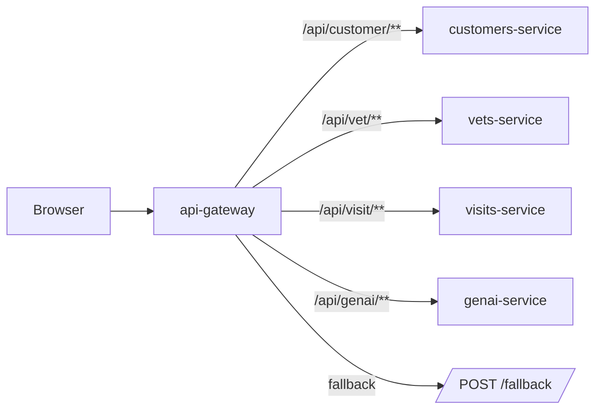
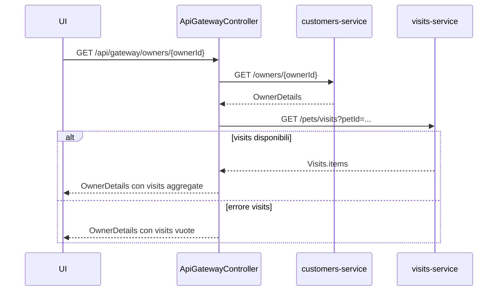

# Backend Architecture

Questo repository e' un progetto Maven multi-modulo in cui ogni microservizio e' una Spring Boot application autonoma. Il backend applicativo e' distribuito tra API Gateway, Customers Service, Vets Service, Visits Service e GenAI Service, con Config Server e Discovery Server come dipendenze di runtime del flusso locale standard.

## Servizi backend

| Modulo | Responsabilita' principale | Note operative |
| --- | --- | --- |
| `spring-petclinic-api-gateway` | espone il frontend AngularJS e instrada `/api/customer/**`, `/api/vet/**`, `/api/visit/**`, `/api/genai/**`; aggrega owner details | usa Spring Cloud Gateway WebFlux, Eureka client, Config client e circuit breaker |
| `spring-petclinic-customers-service` | CRUD owners, pet e pet types | usa JPA; default HSQLDB, MySQL opzionale |
| `spring-petclinic-vets-service` | elenco veterinari e specialita' | usa JPA e cache |
| `spring-petclinic-visits-service` | creazione e lettura visite, inclusa query aggregata per piu' pet | usa JPA |
| `spring-petclinic-genai-service` | endpoint chat basato su Spring AI, tool function che leggono/scrivono dati Petclinic e vector store per i veterinari | richiede provider OpenAI o Azure OpenAI per uso completo; dipende anche da Discovery Server per raggiungere Customers e Vets |
| `spring-petclinic-config-server` | configurazione centralizzata | va avviato prima dei servizi applicativi nel flusso locale senza Docker |
| `spring-petclinic-discovery-server` | service registry Eureka | va avviato prima dei servizi applicativi nel flusso locale senza Docker |
| `spring-petclinic-admin-server` | Spring Boot Admin | opzionale |

## Endpoint principali

### API Gateway

| Endpoint | Origine | Scopo |
| --- | --- | --- |
| `GET /api/gateway/owners/{ownerId}` | `ApiGatewayController` | aggrega owner details da Customers e Visits |
| `POST /fallback` | `FallbackController` | risposta testuale `503` per fallback del circuit breaker quando la richiesta inoltrata e' una `POST` |

### Route proxy definite nel gateway

| Route pubblica | Destinazione lb:// | Riscrittura |
| --- | --- | --- |
| `/api/customer/**` | `customers-service` | `StripPrefix=2` |
| `/api/vet/**` | `vets-service` | `StripPrefix=2` |
| `/api/visit/**` | `visits-service` | `StripPrefix=2` |
| `/api/genai/**` | `genai-service` | `StripPrefix=2` |

### Customers Service

| Endpoint reale | Scopo |
| --- | --- |
| `POST /owners` | crea owner |
| `GET /owners/{ownerId}` | legge un owner singolo |
| `GET /owners` | legge la lista owners |
| `PUT /owners/{ownerId}` | aggiorna owner |
| `GET /petTypes` | legge i tipi di pet |
| `POST /owners/{ownerId}/pets` | crea pet per owner |
| `PUT /owners/*/pets/{petId}` | aggiorna pet |
| `GET /owners/*/pets/{petId}` | legge pet details |

### Vets Service

| Endpoint reale | Scopo |
| --- | --- |
| `GET /vets` | legge la lista veterinari |

### Visits Service

| Endpoint reale | Scopo |
| --- | --- |
| `POST /owners/*/pets/{petId}/visits` | crea una visita |
| `GET /owners/*/pets/{petId}/visits` | legge le visite di un pet |
| `GET /pets/visits?petId=...` | legge visite aggregate per piu' pet |

### GenAI Service

| Endpoint reale | Scopo |
| --- | --- |
| `POST /chatclient` | invia il prompt utente al `ChatClient` di Spring AI |

Nota: `VectorStoreController` non espone endpoint HTTP, ma all'evento `ApplicationStartedEvent` carica un `SimpleVectorStore`. Se `vectorstore.json` non e' gia' nel classpath, legge `GET http://vets-service/vets` tramite `WebClient` load-balanced e crea documenti per la ricerca semantica.

## Routing del gateway



## Flusso owner details

`GET /api/gateway/owners/{ownerId}` e' l'unico endpoint aggregatore esplicito gia' presente nel codice. Il controller:

1. legge l'owner dal `CustomersServiceClient`;
2. estrae gli ID dei pet presenti nel DTO;
3. chiama `VisitsServiceClient.getVisitsForPets(...)`;
4. protegge la seconda chiamata con un circuit breaker;
5. in caso di errore del visits service, restituisce comunque l'owner con lista visite vuota.



## Flussi applicativi principali

- Pagina owners: il frontend chiama `GET /api/customer/owners`, che il gateway inoltra al Customers Service.
- Owner details: il frontend chiama `GET /api/gateway/owners/{ownerId}` e riceve un DTO aggregato.
- Pet form: il frontend usa `GET /api/customer/petTypes`, `GET /api/customer/owners/{ownerId}`, `GET /api/customer/owners/{ownerId}/pets/{petId}`, `POST /api/customer/owners/{ownerId}/pets` e `PUT /api/customer/owners/{ownerId}/pets/{petId}`.
- Visits form: il frontend usa `GET /api/visit/owners/{ownerId}/pets/{petId}/visits` e `POST /api/visit/owners/{ownerId}/pets/{petId}/visits`.
- Chatbox: il frontend usa `POST /api/genai/chatclient`, che il gateway inoltra al GenAI Service.
- GenAI tools: `PetclinicTools` delega ad `AIDataProvider`; `listOwners`, `addOwnerToPetclinic` e `addPetToOwner` usano Customers Service, mentre `listVets` interroga il vector store popolato dai dati del Vets Service.

## Dipendenze runtime

- Config Server: ogni servizio usa `spring.config.import` verso Config Server; in profilo `docker` il gateway e il GenAI service puntano a `http://config-server:8888`.
- Discovery Server: il gateway usa URI `lb://...`; Customers, Vets, Visits e GenAI sono progettati per essere risolti tramite Eureka client.
- Database di default: HSQLDB in-memory per Customers, Vets e Visits; il GenAI Service include HSQLDB tra le dipendenze, ma la persistenza applicativa documentata riguarda principalmente i servizi dati Petclinic.
- Database opzionale: MySQL Connector/J e profilo `mysql` sono presenti per gli scenari persistenti documentati nel README. La configurazione effettiva del datasource arriva dal Config Server/config repository, non dai soli `application.yml` locali dei moduli.
- GenAI opzionale: `spring-petclinic-genai-service` puo' usare OpenAI di default (`OPENAI_API_KEY`, con fallback `demo`) oppure Azure OpenAI (`AZURE_OPENAI_ENDPOINT`, `AZURE_OPENAI_KEY`).

## Fallback e limiti attuali

- Il gateway ha un `defaultCircuitBreaker` globale per le route e un circuit breaker dedicato sulla route `/api/genai/**`.
- L'aggregazione owner details ha un fallback esplicito a lista visite vuota.
- Il fallback HTTP centralizzato del gateway espone solo `POST /fallback` e un messaggio testuale "Chat is currently unavailable. Please try again later."; questo e' coerente con la chat GenAI, ma non va letto come contratto errore completo per tutte le route e tutti i metodi.
- Il GenAI service cattura eccezioni nel controller chat e restituisce lo stesso messaggio testuale.
- `AIDataProvider.getCustomerServiceUri()` usa la prima istanza Eureka di `customers-service`; se il servizio non e' registrato, non c'e' un fallback locale nel codice.
- Il contratto errore non e' ancora descritto in modo uniforme tra customers e visits; oggi il repository espone eccezioni e validazioni ma non un documento API error dedicato.

## Test backend esistenti

| Modulo | Test presenti | Focus |
| --- | --- | --- |
| `spring-petclinic-api-gateway` | `ApiGatewayApplicationTests`, `ApiGatewayControllerTest`, `VisitsServiceClientIntegrationTest` | context load, aggregazione owner details, client visits |
| `spring-petclinic-customers-service` | `PetResourceTest` | lettura pet |
| `spring-petclinic-vets-service` | `VetResourceTest` | lista vets |
| `spring-petclinic-visits-service` | `VisitResourceTest` | query `GET /pets/visits` |
| `spring-petclinic-config-server` | `PetclinicConfigServerApplicationTests` | context load |
| `spring-petclinic-discovery-server` | `DiscoveryServerApplicationTests` | context load |
| `spring-petclinic-genai-service` | nessun test sotto `src/test` in questo checkout | gap di copertura: endpoint chat, tool function e vector store non sono coperti da test locali |

## Come eseguire i test backend

Comandi mirati per modulo:

```bash
./mvnw -pl spring-petclinic-api-gateway test
./mvnw -pl spring-petclinic-customers-service test
./mvnw -pl spring-petclinic-vets-service test
./mvnw -pl spring-petclinic-visits-service test
./mvnw -pl spring-petclinic-genai-service test
```

Comando aggregato dal root:

```bash
./mvnw test
```

## Note di validazione

Questo documento e' stato validato tramite lettura di `README.md`, `pom.xml`, `docker-compose.yml`, dei file `application.yml`, dei controller Java e dei test presenti. Non e' una prova che i servizi siano stati avviati in questa sessione.

File sorgente usati come riferimento principale:

- `spring-petclinic-api-gateway/src/main/resources/application.yml`
- `spring-petclinic-api-gateway/src/main/java/org/springframework/samples/petclinic/api/boundary/web/ApiGatewayController.java`
- `spring-petclinic-api-gateway/src/main/java/org/springframework/samples/petclinic/api/boundary/web/FallbackController.java`
- `spring-petclinic-customers-service/src/main/java/org/springframework/samples/petclinic/customers/web/OwnerResource.java`
- `spring-petclinic-customers-service/src/main/java/org/springframework/samples/petclinic/customers/web/PetResource.java`
- `spring-petclinic-vets-service/src/main/java/org/springframework/samples/petclinic/vets/web/VetResource.java`
- `spring-petclinic-visits-service/src/main/java/org/springframework/samples/petclinic/visits/web/VisitResource.java`
- `spring-petclinic-genai-service/src/main/java/org/springframework/samples/petclinic/genai/PetclinicChatClient.java`
- `spring-petclinic-genai-service/src/main/java/org/springframework/samples/petclinic/genai/PetclinicTools.java`
- `spring-petclinic-genai-service/src/main/java/org/springframework/samples/petclinic/genai/AIDataProvider.java`
