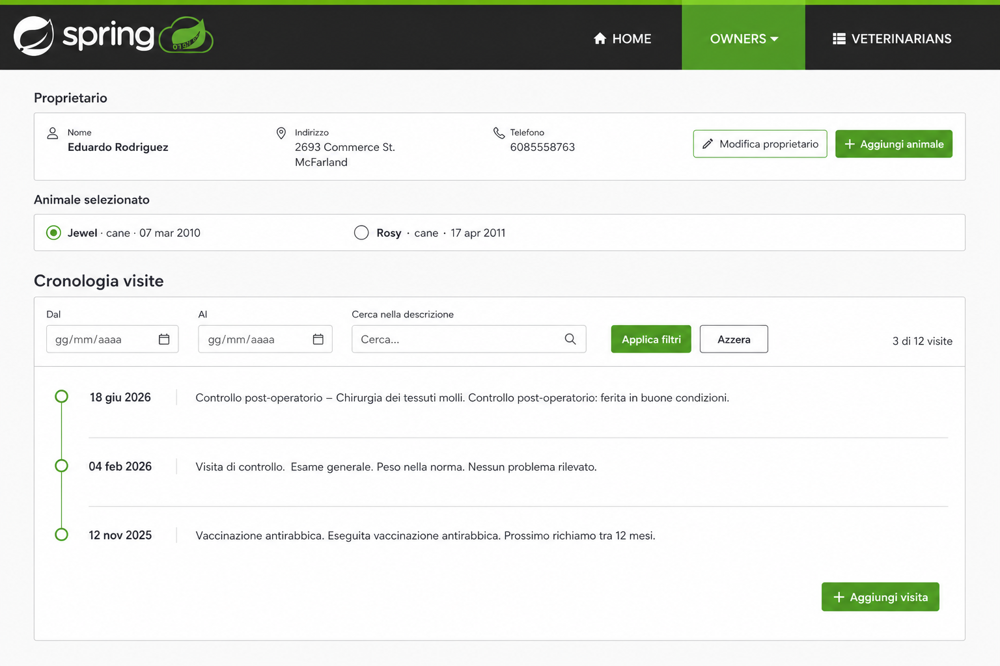

# Design del prototipo

Il concept deriva dalla schermata PetClinic esistente e conserva shell,
palette e tipografia documentate in `design-system/`. Il prototipo traduce il
concept in HTML/CSS/JavaScript isolato e non applica i token all'applicazione.

## Gerarchia e componenti

1. **Contesto proprietario compatto.** Nome e recapiti restano visibili prima
   del compito, senza competere con la cronologia.
2. **Scelta esplicita dell'animale.** Radio button con nome, specie e data di
   nascita; gli omonimi rimangono distinguibili tramite gli altri attributi.
3. **Intestazione contestuale.** `Cronologia visite di <animale>` mantiene
   riconoscibile il soggetto durante filtro e scorrimento.
4. **Rail dei filtri.** Dal, Al e testo precedono azioni e conteggio. Il focus
   resta visibile e l'intervallo errato è annunciato.
5. **Timeline aperta.** Una sola superficie, data a sinistra e descrizione
   completa come testo a destra; nessun campo non presente nel contratto.
6. **Stati esclusivi.** Risultati, vuoto, indisponibilità ed errore filtro non
   appaiono contemporaneamente.

## Token e comportamento responsive

- Pagina bianca, testo `#34302d`, accento `#6db33f`, bordi Bootstrap chiari.
- Montserrat per titoli/controlli e Varela Round per il contenuto, con fallback
  sans-serif nel prototipo autonomo.
- Desktop: data e descrizione su due colonne nella stessa riga.
- Sotto 768 px: navigazione semplificata, selettori impilati, timeline a una
  colonna e azioni larghe quanto il contenuto.
- Nessuna animazione necessaria. `prefers-reduced-motion` non cambia il flusso.

## Accessibilità e sicurezza del contenuto

- Un solo `h1`, etichette associate, `fieldset` per gli animali, stato con
  `role=status`, errore con `role=alert` e focus visibile.
- L'ordine DOM segue quello visivo e il percorso completo funziona da tastiera.
- Le descrizioni sono inserite con `textContent`, mai come HTML.
- Filtri e selezione non persistono in URL o storage e non emettono telemetria.

## Confine per COG-158

Il design non autorizza nuovi dati o servizi. La candidata deve usare le visite
già aggregate, mantenere `Add Visit`, introdurre lo stato osservabile dello
storico e implementare le regole in [rules-and-cases.md](rules-and-cases.md).
Il prototipo non è una patch pronta da copiare nel controller AngularJS.

## Verifica di fedeltà

Concept e rendering desktop sono stati ispezionati direttamente alla stessa
risoluzione 1536 × 1024. Il confronto ha verificato:

| Punto | Concept | Rendering | Esito |
|---|---|---|---|
| Shell | Charcoal, bordo verde, Owners attivo | Stessa struttura e palette; asset Spring riusato dal repository | Conforme |
| Gerarchia | Proprietario → animale → cronologia | Stesso ordine e stessa prevalenza della cronologia | Conforme |
| Controlli | Due animali, tre filtri, applica/azzera, conteggio | Stessi componenti e percorso da tastiera | Conforme |
| Timeline | Una superficie aperta, date a sinistra, testo a destra | Stesso modello; date localizzate in italiano | Conforme |
| Palette e bordi | Bianco, charcoal, verde, separatori sottili | Token repository senza gradienti o card aggiuntive | Conforme |
| Mobile | Continuazione responsive richiesta | Colonna singola a 390 px senza overflow | Conforme |

Deviazioni intenzionali: il titolo include `di Jewel` per soddisfare il vincolo
di contesto; il prototipo mostra una breve spiegazione testuale sulla
descrizione completa; i campi data usano il controllo nativo del browser. Non
sono stati introdotti campi visita oltre a data e descrizione.
