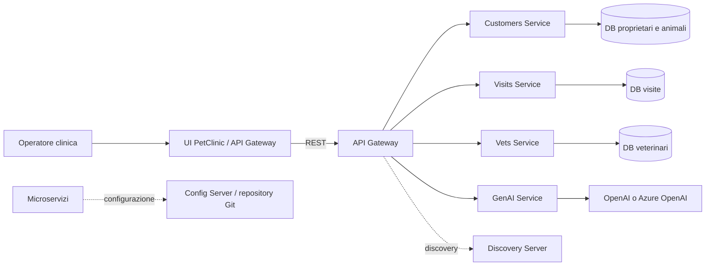
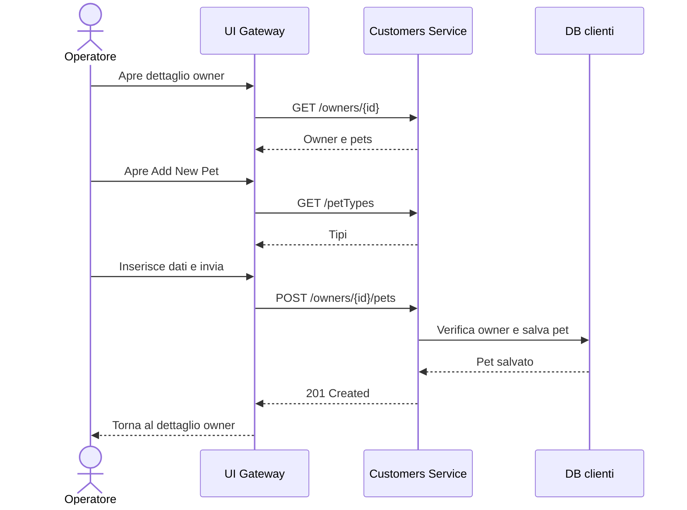
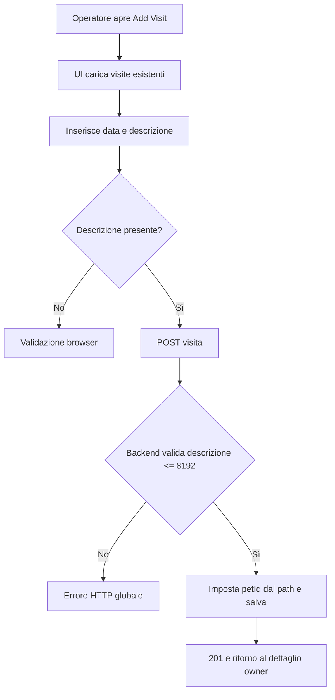
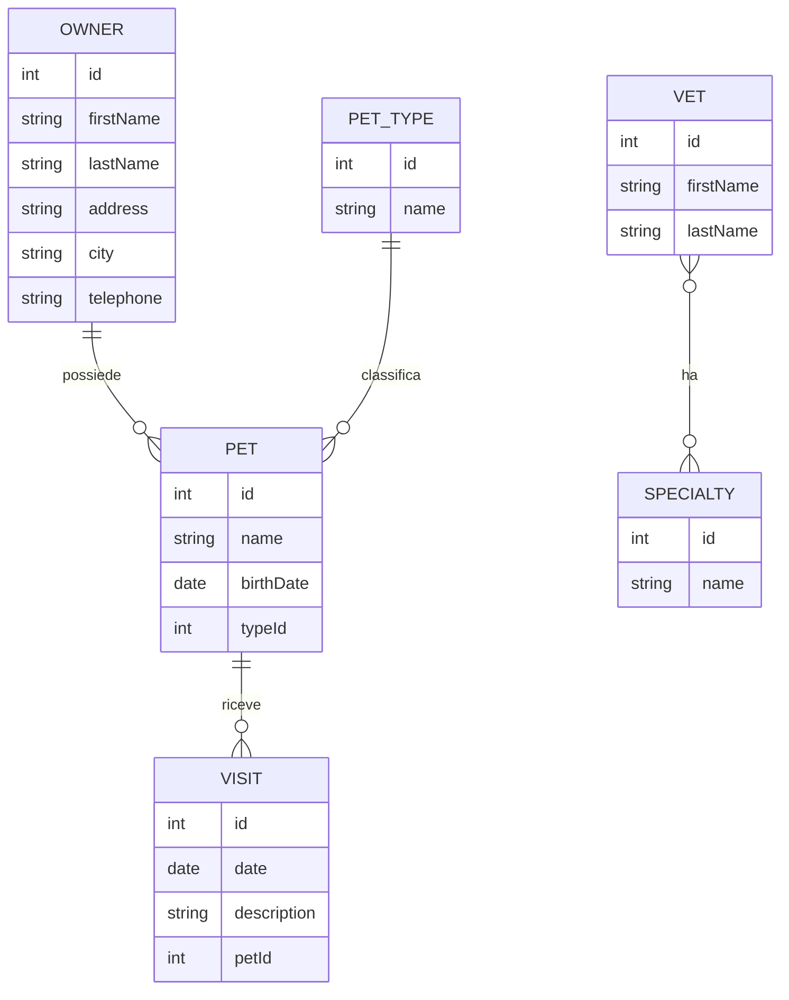

# Specifica funzionale dell’applicazione

## 1. Scopo e perimetro

Spring PetClinic Microservices è un’applicazione dimostrativa per la gestione di una clinica veterinaria. Il perimetro verificabile comprende:

- consultazione e modifica dei proprietari;
- consultazione, inserimento e modifica degli animali;
- inserimento e consultazione delle visite;
- consultazione dell’elenco dei veterinari e delle specialità;
- consultazione aggregata di proprietario, animali e visite;
- interazione conversazionale GenAI con alcune operazioni guidate;
- configurazione centralizzata, service discovery, fallback tecnico e metriche.

La UI è esposta dal gateway sulla porta 8080 nella configurazione Compose. I servizi espongono API REST interne o instradate dal gateway. Il database predefinito è HSQLDB in memoria con dati iniziali; è previsto anche un profilo MySQL (`README.md`, sezione Database configuration).

### Contesto

Evidenze: `README.md`; `spring-petclinic-api-gateway/src/main/resources/application.yml:20-45`; `docker-compose.yml:1-161`.

## 2. Attori e autorizzazioni

L’attore funzionale osservabile è l’operatore della clinica, che usa la UI o un sistema chiamante le API. Il chatbot è un secondo canale di interazione, non un ruolo distinto.

| Operazione | UI | API/backend | Restrizioni osservate |
|---|---:|---:|---|
| Elencare proprietari | Sì | GET `/owners` | Nessun controllo di ruolo rilevato |
| Leggere dettaglio proprietario | Sì | GET aggregato gateway | Nessun controllo di ruolo rilevato |
| Creare/modificare proprietario | Sì | POST/PUT `/owners` | Validazione dati; nessuna autorizzazione rilevata |
| Creare/modificare animale | Sì | POST/PUT pets | Owner esistente in creazione; nessun controllo esplicito di ownership in update |
| Creare/leggere visite | Sì | POST/GET visits | `petId >= 1` sugli endpoint; nessun controllo che l’animale esista rilevato |
| Elencare veterinari | Sì | GET `/vets` | Cache backend; nessun controllo di ruolo rilevato |
| Usare chatbot | Sì | POST `/chatclient` | Dipende dal provider LLM e dalla discovery; nessuna autenticazione rilevata |

Non sono presenti evidenze di login, utenti, tenant, permessi, separazione organizzativa o controllo accessi. La tabella distingue quindi capacità esposte, non autorizzazioni di sicurezza.

## 3. Mappa delle funzionalità

| ID | Area | Funzionalità | Stato |
|---|---|---|---|
| F-01 | Proprietari | Elenco con filtro locale | Implementata |
| F-02 | Proprietari | Creazione e modifica | Implementata, validazioni UI/backend non identiche |
| F-03 | Animali | Creazione e modifica con tipo | Implementata |
| F-04 | Visite | Inserimento e consultazione per animale | Implementata |
| F-05 | Veterinari | Elenco e specialità | Implementata, risposta cacheabile |
| F-06 | Dettaglio | Aggregazione proprietario-animali-visite | Implementata con fallback parziale |
| F-07 | GenAI | Chat e strumenti dati | Implementata e condizionata a LLM/configurazione |
| F-08 | Piattaforma | Config, discovery, osservabilità | Implementata come infrastruttura/configurazione; attivazione runtime da confermare |

## 4. Schede funzionali

### F-01 — Elenco proprietari

**Attori e avvio.** L’operatore apre la vista Owners. Il controller chiama `GET api/customer/owners` (`owner-list.controller.js:7-9`), instradata dal gateway a Customers Service (`application.yml:33-37`).

**Input e flusso.** Il filtro testuale è opzionale e viene applicato nel browser con il filtro AngularJS; non è inviato al backend (`owner-list.template.html:3-7,20-29`). La tabella mostra nome, indirizzo, città, telefono e nomi degli animali.

**Esito ed eccezioni.** In caso di risposta valida sono mostrate le righe. Il codice non definisce stato vuoto o messaggio di caricamento dedicato. Gli errori HTTP passano all’interceptor globale (`httpErrorHandlingInterceptor.js:7-15`), che presume un payload con `error` e `errors`; il comportamento per altri payload non è definito.

### F-02 — Creazione e modifica proprietario

**Precondizioni.** Per la modifica deve esistere l’owner ID. Per la creazione la UI apre un modello vuoto (`owner-form.controller.js:7-15`).

**Input e regole.** Nome, cognome, indirizzo e città sono obbligatori in UI. Il telefono è obbligatorio, massimo 12 caratteri e in UI deve rispettare `[0-9]{12}` (`owner-form.template.html:3-33`). Il backend applica `@NotBlank` ai primi quattro campi e a telefono, con `@Digits(integer=12,fraction=0)` (`Owner.java:45-64`; `OwnerRequest.java` nello stesso package). La creazione restituisce 201 e salva il proprietario; la modifica restituisce 204 e fallisce se l’ID non esiste (`OwnerResource.java:54-91`).

**Percorsi.** Dopo creazione si torna all’elenco; dopo modifica al dettaglio (`owner-form.controller.js:17-28`). Non risultano annullamento esplicito, eliminazione, audit o recupero UI.

### F-03 — Creazione e modifica animale

**Precondizioni e input.** L’animale è associato a un proprietario. La UI carica i tipi da `GET api/customer/petTypes`, usa il tipo 1 come default in creazione e richiede nome e data di nascita (`pet-form.controller.js:8-28`; `pet-form.template.html:11-33`). I tipi iniziali sono cat, dog, lizard, snake, bird, hamster (`customers-service/.../data.sql:1-6`).

**Flusso.** In creazione il backend verifica l’esistenza del proprietario, collega l’animale e salva nome, data e tipo se il tipo esiste (`PetResource.java:54-85`). In modifica legge l’ID dell’animale dal body e salva; il path owner non viene usato per verificare la relazione (`PetResource.java:68-74`). Il GET dettaglio fallisce se l’animale non esiste (`PetResource.java:88-97`).

**Limiti.** Nel backend non risultano `@Valid` o vincoli espliciti su nome/data/tipo; un `typeId` inesistente non genera errore nel metodo `save`. La UI non mostra stati errore o caricamento dedicati.

### F-04 — Visite

**Precondizioni e input.** La UI inizializza la data al giorno corrente, richiede la descrizione e consente l’invio (`visits.controller.js:7-24`; `visits.template.html:3-18`). La data è serializzata `yyyy-MM-dd`; il backend limita la descrizione a 8192 caratteri (`Visit.java:39-49`).

**Flusso principale.** All’apertura viene eseguito GET delle visite dell’animale; l’operatore invia POST, il backend imposta sempre `petId` dal path e salva restituendo 201. Dopo successo torna al dettaglio proprietario (`VisitResource.java:56-75`).

**Alternative/limiti.** È disponibile anche la lettura aggregata `GET pets/visits?petId=...` per più animali. Non sono presenti modifica, eliminazione, annullamento, scadenza o verifica esplicita dell’esistenza del pet prima della creazione.

### F-05 — Elenco veterinari

La vista carica `GET api/vet/vets` e mostra nome e specialità (`vet-list.controller.js:7-9`; `vet-list.template.html:1-14`). Il backend restituisce tutti i veterinari e annota il metodo con `@Cacheable("vets")` (`VetResource.java:34-48`). Non sono disponibili creazione, modifica, ricerca o filtri nella UI.

### F-06 — Dettaglio aggregato

Il dettaglio chiama `GET api/gateway/owners/{ownerId}`. Gateway legge il proprietario da Customers Service, raccoglie gli ID dei pet e chiama Visits Service, poi associa ogni visita al pet con lo stesso ID (`ApiGatewayController.java:54-77`). La UI mostra dati owner, pet, visite e collegamenti a modifica pet/nuova visita (`owner-details.template.html:3-67`).

Se la chiamata visite fallisce, il circuit breaker restituisce una lista visite vuota e il proprietario viene comunque restituito (`ApiGatewayController.java:58-64,80-82`). Il risultato è quindi parziale, ma la UI non espone un messaggio specifico di dati incompleti. L’owner inesistente produce l’esito dipendente dal client/backend; non è definito un fallback analogo.

### F-07 — Chatbot GenAI

**Interazione.** Il widget non invia messaggi vuoti, visualizza subito il messaggio dell’utente, chiama `POST /api/genai/chatclient` e mostra la risposta testuale; Enter invia e localStorage conserva il markup della conversazione (`genai/chat.js:29-80`). In caso di errore mostra un testo di indisponibilità.

**Strumenti verificati.** Il client LLM può invocare: elenco proprietari; creazione proprietario; elenco veterinari con ricerca semantica; aggiunta animale (`PetclinicTools.java:38-71`). Le operazioni dati usano Customers Service via discovery; l’elenco veterinari usa un vector store locale (`AIDataProvider.java:42-86`). Per la ricerca veterinari `topK` è 50 senza parametri e 20 con parametri (`AIDataProvider.java:51-68`).

**Condizionamenti.** Il servizio usa OpenAI di default con modello `gpt-4o-mini` e chiave `OPENAI_API_KEY` oppure Azure OpenAI (`genai-service/src/main/resources/application.yml:14-29`). Il provider, la disponibilità delle credenziali, il vector store e la discovery non sono verificati a runtime. Errori LLM sono trasformati in una risposta testuale di indisponibilità (`PetclinicChatClient.java:57-70`).

### F-08 — Configurazione, discovery e osservabilità

Config Server legge di default il repository Git `spring-petclinic-microservices-config`, oppure una directory locale con profilo `native` (`config-server/src/main/resources/application.yml:1-11`; `README.md`). Eureka è il registro dei servizi; il gateway usa URI `lb://...` (`api-gateway/application.yml:20-45`). Compose dichiara healthcheck per Config e Discovery e dipendenze di avvio (`docker-compose.yml:1-114`). Sono presenti Admin Server, Zipkin, Prometheus e Grafana, ma la loro effettiva esecuzione è una scelta di deployment.

## 5. Processi completi

### P-01 — Registrazione e gestione di un animale

La modifica sostituisce la POST con PUT e salva usando l’ID nel body. Evidenze: controller UI e `PetResource.java:54-85`.

### P-02 — Inserimento visita

Non sono verificati transazioni distribuite, retry applicativi o processi asincroni: le chiamate sono sincrone dal punto di vista del browser.

## 6. Dati di business e ciclo di vita

Le cardinalità owner-pet, pet-type e pet-visit sono supportate dagli schemi e dalle relazioni JPA (`Owner.java:37-67`; schemi HSQLDB). Il legame visita-pet è per ID nel servizio visite, senza foreign key nello schema (`visits-service/.../schema.sql:3-8`). Veterinari-specialità è una relazione molti-a-molti tramite tabella ponte (`vets-service/.../schema.sql:18-23`).

Gli ID sono generati dal database. Sono presenti creazione e aggiornamento di owner/pet e creazione visite; non sono presenti endpoint di eliminazione, archiviazione, modifica visite o storico/audit. I dati iniziali HSQLDB vengono caricati all’avvio. Persistenza, reset e isolamento tra ambienti dipendono dal profilo di database.

## 7. Regole di business

| ID | Regola verificata | Fonte |
|---|---|---|
| BR-01 | Owner: nome, cognome, indirizzo, città e telefono non blank | `customers-service/.../model/Owner.java:45-64` |
| BR-02 | Telefono backend numerico, massimo 12 cifre; UI richiede esattamente 12 | `Owner.java:61-64`; `owner-form.template.html:28-33` |
| BR-03 | Owner update richiede ID esistente; create restituisce 201, update 204 | `OwnerResource.java:57-90` |
| BR-04 | Pet creato solo dopo verifica dell’owner | `PetResource.java:54-65` |
| BR-05 | Tipi iniziali: cat, dog, lizard, snake, bird, hamster | `customers-service/.../data.sql:1-6` |
| BR-06 | Visita associazione: `petId` del path prevale sul body | `VisitResource.java:56-64` |
| BR-07 | Descrizione visita massimo 8192 caratteri | `Visit.java:44-46` |
| BR-08 | Fallback dettaglio owner: errore visite => owner con zero visite | `ApiGatewayController.java:58-64,80-82` |
| BR-09 | Ricerca veterinari: limite 50 senza filtro, 20 con filtro | `AIDataProvider.java:51-68` |

Non risultano soglie di età, unicità di nomi, vincoli di data visita, eliminazione, autorizzazioni o regole tenant. Questi sono punti da confermare, non assenze funzionali dimostrate.

## 8. Comportamenti trasversali, errori e limiti

- Il gateway applica CircuitBreaker generale con fallback `/fallback` e un retry per POST su `503`; la configurazione non dimostra una garanzia di disponibilità (`api-gateway/application.yml:10-19`).
- Il dettaglio owner degrada a risultato parziale quando fallisce Visits Service. Non è indicato all’utente.
- Non sono visibili idempotency key, deduplicazione o gestione esplicita di invii simultanei. POST ripetute possono creare più record: deduzione da assenza di controllo, da confermare con test runtime.
- La UI ha gestione errore globale, ma presume una struttura errore specifica e non definisce stati loading/empty/retry per le viste principali.
- La chat salva HTML in localStorage; non è definita una scadenza o cancellazione della cronologia.
- Il servizio veterinari usa cache `vets`; invalidazione e durata non sono configurate nel codice esaminato.
- Non risultano audit trail, notifiche, job schedulati, code o callback applicativi.
- Dati e funzionalità non risultano separati per organizzazione o cliente.

## 9. Glossario

**Owner/proprietario:** persona che possiede uno o più animali.

**Pet/animale:** animale registrato, con nome, data di nascita e tipo.

**Visit/visita:** registrazione datata con descrizione associata a un pet.

**Vet/veterinario:** professionista mostrato con eventuali specialità.

**Gateway:** punto di ingresso UI/API che instrada e, per il dettaglio owner, aggrega dati.

**GenAI/LLM:** servizio conversazionale che può invocare strumenti applicativi configurati.

**Eureka/Discovery:** registro usato dai servizi per individuarsi.

