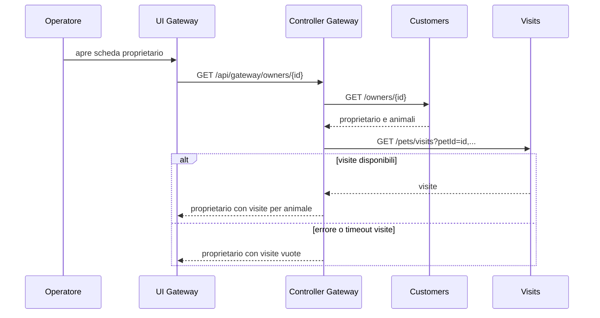

# Funzionalità e processi

## Mappa delle funzionalità

| ID | Area | Funzionalità | Attori | Stato |
|---|---|---|---|---|
| FUN-OWN-01 | Proprietari | Elencare e filtrare localmente i proprietari | Operatore | Implementata |
| FUN-OWN-02 | Proprietari | Creare e modificare un proprietario | Operatore; chatbot per creazione | Implementata |
| FUN-OWN-03 | Scheda | Consultare proprietario, animali e visite aggregate | Operatore | Implementata con degrado parziale |
| FUN-PET-01 | Animali | Consultare tipi, creare e modificare un animale | Operatore; chatbot per creazione | Implementata |
| FUN-VIS-01 | Visite | Consultare e registrare visite | Operatore | Implementata |
| FUN-VET-01 | Veterinari | Consultare veterinari e specializzazioni | Operatore | Implementata, sola lettura |
| FUN-GEN-01 | Chatbot | Dialogare e interrogare/creare dati tramite LLM | Operatore | Condizionata da provider/configurazione |
| FUN-OPS-01 | Operatività | Routing, configurazione, discovery, osservabilità | Sistema | Implementata/condizionata dal runtime |

## Schede funzionali

### FUN-OWN-01 — Elenco proprietari

**Obiettivo e avvio.** L'operatore apre `/owners`; il browser richiede `GET /api/customer/owners` e mostra nome, indirizzo, città, telefono e nomi degli animali. Il campo “Search Filter” filtra solo l'elenco già ricevuto nel browser, senza endpoint di ricerca.

**Esito e limiti.** Il servizio restituisce tutti i proprietari senza paginazione o ordinamento esplicito. La UI non definisce uno stato di caricamento, elenco vuoto o messaggio di errore; l'interceptor HTTP mostra un alert per le risposte di errore. Evidenze: `owner-list.controller.js`, `owner-list.template.html`, `OwnerResource.findAll`.

### FUN-OWN-02 — Crea/modifica proprietario

**Precondizioni/input.** Per modifica il proprietario deve essere reperibile; per creazione non è richiesto altro. UI e backend richiedono i cinque campi di RB-OWN-01. La UI impone esattamente 12 cifre con pattern, mentre il backend ammette fino a 12: è una divergenza rilevata.

**Flusso.** Il form invia `POST /api/customer/owners` per creare (201 e record persistito), oppure `PUT /api/customer/owners/{id}` per modificare (204). In modifica il backend cerca l'ID e restituisce 404 se assente; in creazione non esegue controlli contro duplicati. Il browser torna rispettivamente alla lista o alla scheda del proprietario. Non è disponibile annullamento esplicito, né cancellazione.

### FUN-PET-01 — Crea/modifica animale

**Precondizioni/input.** Il form carica i tipi e, in modifica, animale e proprietario. Richiede nome e data in UI; il backend valida esplicitamente solo nome non vuoto, mentre data e tipo non sono `@Valid` sul body. `typeId` è l'ID del catalogo.

**Flusso ed eccezioni.** Creazione: `POST /owners/{ownerId}/pets`, il servizio recupera il proprietario, collega l'animale e salva. Modifica: `PUT /owners/*/pets/{petId}`, ma il controller ignora il `petId` nel path e usa `id` nel body: la coerenza path/body non è verificata. Animale o proprietario mancanti danno 404; tipo inesistente lascia l'animale senza tipo invece di restituire errore (RB-PET-02). Dopo successo la UI torna alla scheda.

### FUN-VIS-01 — Consultazione e registrazione visite

**Precondizioni/input.** Dalla scheda animale l'operatore apre la pagina visite, che legge `GET /owners/{ownerId}/pets/{petId}/visits`. La creazione invia data (precompilata a oggi nella UI) e descrizione con `POST` sullo stesso percorso. La descrizione è obbligatoria lato UI e limitata dal backend a 8.192 caratteri; il backend non convalida che il proprietario o animale esistano nel servizio Customers.

**Esito.** Il servizio salva la visita col `petId` del path e la pagina rientra nella scheda proprietario. Non ci sono modifica, cancellazione, appuntamento futuro, approvazione o notifica.

### FUN-OWN-03 — Scheda proprietario aggregata

Il flusso `PROC-DET-01` è sincrono dal punto di vista dell'utente, pur usando API reattive internamente. Le visite vengono associate confrontando gli ID; non c'è transazione distribuita. Se la lista animali è vuota, l'implementazione forma comunque una richiesta `petId=`: il comportamento del servizio Visits in quel caso non è coperto da test e va confermato.

### FUN-VET-01 — Elenco veterinari

La UI `/vets` legge `GET /api/vet/vets` e mostra nome e specializzazioni. Il servizio legge tutti i record e dichiara cache `vets`; non offre create/update/delete. Il chatbot ricerca su vector store anziché interrogare direttamente l'elenco per ogni domanda; la fonte può essere un file pre-embedded o un caricamento dai veterinari all'avvio.

### FUN-GEN-01 — Chatbot

L'utente apre/minimizza il widget, inserisce testo e invia `POST /api/genai/chatclient` come stringa JSON. La UI mostra subito il messaggio utente, poi la risposta testuale resa in HTML Markdown; in errore di rete mostra un testo di indisponibilità. Salvataggio/ripristino dei messaggi è definito in funzioni JavaScript, ma non risultano chiamate dalla UI: è quindi **previsto nel codice ma non collegato al flusso visibile**.

Il GenAI service inoltra il prompt al ChatClient con memoria e strumenti. Il modello decide se invocare: elenco proprietari, creazione proprietario, elenco/recherche veterinari, creazione animale. Il servizio intercetta eccezioni e restituisce lo stesso messaggio di indisponibilità come risposta 200; l'utente non può distinguere questo caso da una risposta di business se non dal testo. L'uso dipende da chiave/provider; il valore predefinito della chiave OpenAI è `demo`, perciò non dimostra un chatbot operativo.

### FUN-OPS-01 — Supporto operativo

Il Gateway instrada i prefissi `customer`, `visit`, `vet`, `genai` e serve la SPA. Config Server legge per default un repository Git esterno; Discovery abilita la localizzazione dei servizi. Compose coordina l'avvio tramite health check per Config e Discovery e espone anche tracing, metriche e dashboard. Questi componenti non costituiscono funzionalità utente di clinica; la loro attivazione è condizionata dall'ambiente.

## Processo completo PROC-REG-01 — Registrazione visita

1. L'operatore apre un proprietario e seleziona “Add Visit” sull'animale.
2. La UI legge le visite già registrate e precompila la data con oggi.
3. L'operatore inserisce descrizione e invia; il Gateway instrada al servizio Visits.
4. Il servizio sostituisce il `petId` del body con quello del path, verifica i vincoli noti e persiste.
5. La UI torna alla scheda aggregata; se Visits è indisponibile durante questa lettura successiva, il Gateway può mostrare la scheda senza visite (RB-DET-01).

## Esperienza utente e stati

Le pagine hanno form e transizioni solo dopo la risposta positiva. Non è implementato un indicatore di caricamento, un messaggio di successo, un'azione annulla o una ripresa guidata dopo errore. L'interceptor globale tenta di mostrare `error.error` ed `error.errors`; questi campi non sono dimostrati per gli errori dei controller, dunque la qualità del messaggio dipende dalla risposta reale. La UI non cambia in funzione di ruoli.
