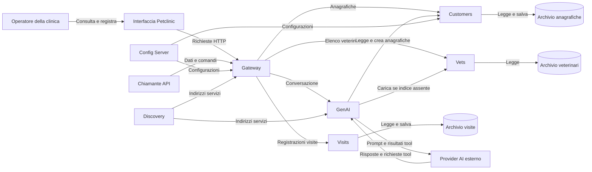
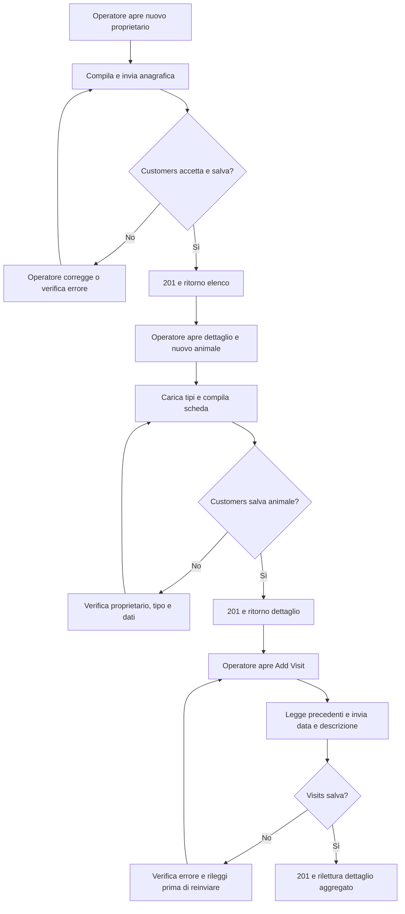
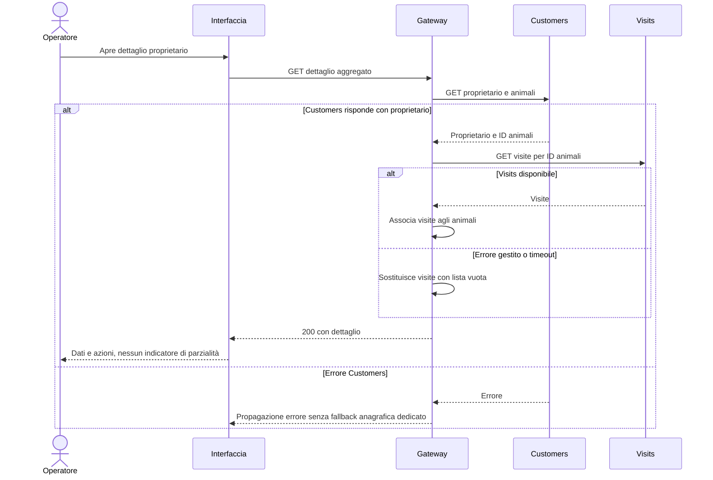
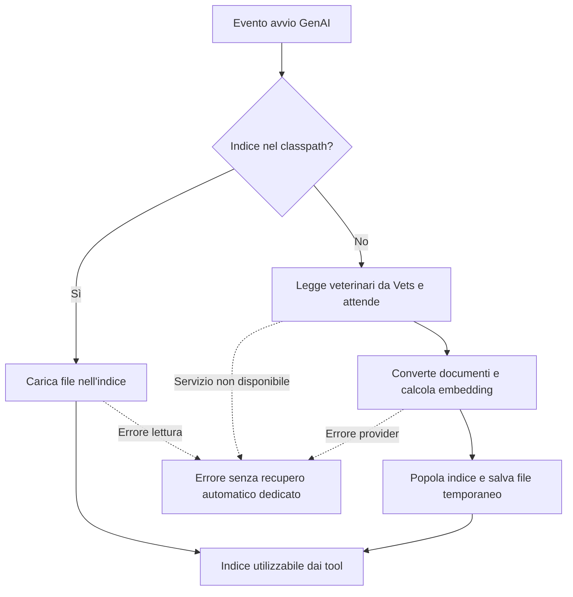
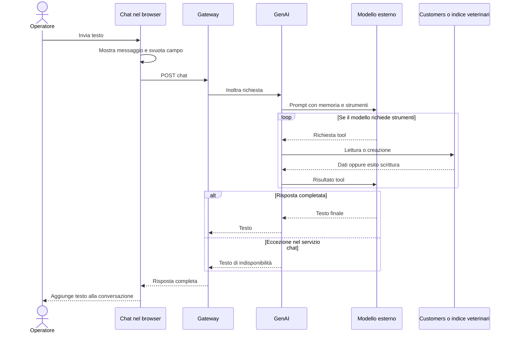
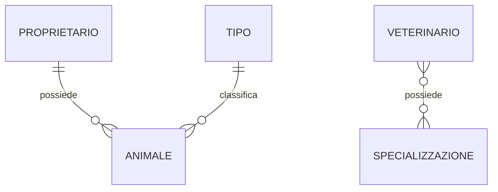
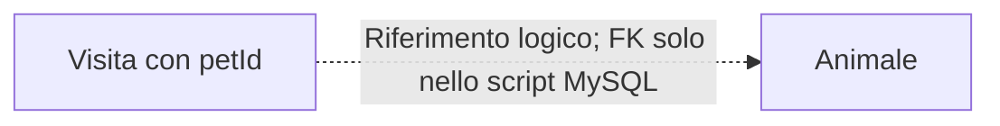

# Processi completi e diagrammi

[Indice](README.md) · [Funzioni](funzionalita.md) · [Regole](regole.md) · [Fonti](verifica-evidenze.md)

## D01 — Contesto applicativo

F01–F08; E02–E12. Le frecce etichettano richieste o dati. “Operatore” è un attore dedotto; non rappresenta un ruolo autorizzativo implementato.

Gli archivi sono responsabilità logiche: il diagramma non garantisce database fisicamente separati. Config e Discovery supportano anche gli altri servizi; le frecce sono ridotte per leggibilità. E13 mostra una possibile relazione SQL MySQL fra archivi visite e animali.

## P01 / D02 — Registrare proprietario, animale e visita

F02, F03, F05; R01–R04, R06, R13; E02–E04, E06. L'operatore avvia tre salvataggi distinti. Non esiste una transazione unica: se la visita fallisce, proprietario e animale già creati restano. Nessuna approvazione o notifica a cliente/veterinario è individuata.

I nodi di correzione descrivono l'intervento manuale, non una procedura guidata implementata. La gestione errori UI è incompleta (R12); verificare tramite rilettura anziché affidarsi alla sola navigazione. Duplicati non prevenuti.

## P02 / D03 — Consultare il dettaglio anche con Visits indisponibile

F04; R05; E08, E15. Il browser avvia una richiesta asincrona rispetto alla pagina, ma l'operazione HTTP attende la composizione del risultato: non viene creato un job in background.

Il test dell'aggregatore simula sia successo sia errore Visits con mock; non dimostra una catena reale di servizi avviati. Il recupero dopo indisponibilità è una nuova lettura.

## P03 / D04 — Chat e preparazione dell'indice

F07–F08; R07, R09–R11; E09–E11. Il caricamento avviene sull'evento di avvio, senza scheduler o coda applicativa. È separato dalle richieste chat.

Nessuna freccia da file temporaneo a classpath: quel passaggio non è implementato. Un indice caricato può essere diverso dal catalogo corrente.

### D05 — Richiesta chat con lettura o scrittura

F07; E06–E10. Il modello può invocare più tool; non è garantito che ne invochi uno. Le richieste e le risposte del provider sono parte della stessa operazione dal punto di vista del browser.

Non è rappresentata un'approvazione perché non esiste un controllo dedicato nel percorso. Un timeout gateway o un errore dopo la scrittura non costituisce rollback. Inviare nuovamente il testo può ripetere la creazione.

## D06 — Modello concettuale

F02–F06; E02–E05, E13. Le cardinalità proprietario–animale e tipo–animale sono sostenute dagli script SQL con chiavi obbligatorie; quelle veterinario–specializzazione dalla relazione molti-a-molti. Per le visite il collegamento ad animale è logico e il vincolo fisico varia per database.

Non esiste relazione visita–veterinario nel modello esaminato. Non si aggiunge un diagramma di stati clinici: le entità non hanno stato di prenotazione, approvazione, annullamento o scadenza. Creazione e modifica sono operazioni sui dati, non transizioni di un workflow clinico documentato.
