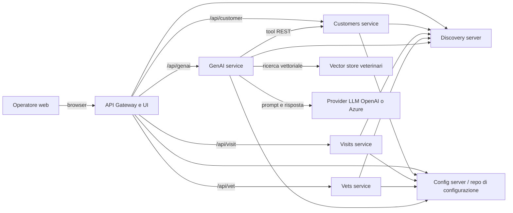
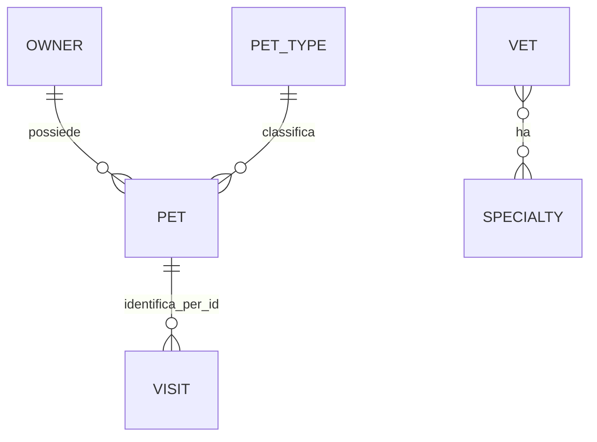

# Sistema, perimetro, attori e dati

## Scopo e confini

L'applicazione è una pet clinic dimostrativa distribuita: consente di consultare e mantenere proprietari e relativi animali, registrare e leggere visite, consultare veterinari e specializzazioni, e usare un chatbot in linguaggio naturale. La UI è servita dal Gateway; i dati di proprietari/animali, visite e veterinari appartengono a tre servizi distinti. Il Gateway compone la scheda di un proprietario con le visite dei suoi animali.

Il repository dichiara il progetto come esempio Spring Petclinic a microservizi (`README.md`) e include Config Server, Discovery Server, Admin Server, Zipkin, Prometheus e Grafana. Configurazione centralizzata e service discovery sono dipendenze di runtime; i dati GenAI dipendono anche da provider OpenAI/Azure OpenAI e dalle rispettive credenziali, non riportate qui. Non sono implementati pagamenti, appuntamenti/prenotazioni, cancellazione di anagrafiche o visite, gestione utenti, tenant o workflow di approvazione.

## Contesto (DGM-CTX-01)

Il diagramma rappresenta chiamate dichiarate nel codice e nelle route, non la disponibilità in un ambiente. Evidenze: `spring-petclinic-api-gateway/src/main/resources/application.yml`, `AIDataProvider`, `PetclinicChatClient`.

## Attori e autorizzazioni

Non sono presenti login, ruoli, annotazioni di autorizzazione o filtri di sicurezza nei servizi e nella UI esaminati. Pertanto il solo attore verificabile è un **operatore web/API non autenticato**: chi raggiunge gli endpoint può eseguire le operazioni esposte. Non è possibile dedurre identità reale, responsabilità organizzativa o autorizzazioni d'infrastruttura dal repository.

| Operazione | Operatore web/API | Controllo applicativo verificato |
|---|---:|---|
| Consultare proprietari, animali, visite e veterinari | Sì | Nessuna autenticazione/autorizzazione nel codice esaminato |
| Creare/modificare proprietari e animali | Sì | Validazione di alcuni campi; nessun ruolo |
| Creare visite | Sì | Validazione del contenuto e ID animale positivo; nessun ruolo |
| Usare chatbot e azioni suggerite dal modello | Sì | Nessun ruolo; il modello può invocare strumenti di lettura e creazione |
| Modificare/cancellare visite o veterinari | No endpoint verificato | Non applicabile |

## Dati di business e ciclo di vita

Le cardinalità Owner–Pet e Vet–Specialty sono esplicite nei modelli JPA. Il collegamento Pet–Visit è un `petId` scalare nel servizio visite, senza chiave esterna o verifica dell'esistenza dell'animale nel servizio Customers.

| Entità | Significato e campi rilevanti | Ciclo di vita osservato |
|---|---|---|
| Owner | id, nome, cognome, indirizzo, città, telefono, animali | creazione e modifica; lettura singola/elenco; nessuna eliminazione |
| Pet | id, nome, data nascita, tipo, proprietario | creato per proprietario e modificabile; tipo cercato per ID; nessuna eliminazione |
| PetType | id e nome del tipo animale | sola lettura; elenco ordinato per nome |
| Visit | id, data (predefinita alla creazione oggetto), descrizione fino a 8.192 caratteri, petId | creazione e lettura per animale o gruppo; nessuna modifica/eliminazione |
| Vet | id, nome, cognome, specializzazioni | sola lettura, elenco in cache |
| Specialty | id e nome | catalogo associato a veterinari, sola lettura |

## Regole di business

| ID | Regola verificata | Evidenza |
|---|---|---|
| RB-OWN-01 | Per creare o aggiornare un proprietario sono obbligatori nome, cognome, indirizzo, città e telefono; il telefono deve contenere solo cifre e al massimo 12 cifre. | `OwnerRequest`, `OwnerResource` |
| RB-PET-01 | Un animale nuovo è associato al proprietario indicato nel path; se il proprietario non esiste, la richiesta termina con 404. | `PetResource.processCreationForm` |
| RB-PET-02 | Il nome dell'animale deve avere almeno un carattere. Il tipo è assegnato solo se il `typeId` esiste: un ID sconosciuto non genera errore esplicito. | `PetRequest`, `PetResource.save` |
| RB-VIS-01 | La visita è salvata con il `petId` del path, sovrascrivendo l'eventuale valore nel body; ID animale deve essere >= 1 e descrizione massimo 8.192 caratteri. | `VisitResource.create`, `Visit` |
| RB-DET-01 | Nel dettaglio proprietario, se la lettura delle visite fallisce, il Gateway restituisce comunque il proprietario con liste visite vuote; se fallisce la lettura del proprietario, non esiste fallback verificato. | `ApiGatewayController.getOwnerDetails` |
| RB-GEN-01 | Il chatbot mantiene fino a 10 messaggi precedenti secondo il commento/configurazione dell'advisor e può invocare strumenti per elencare proprietari/veterinari e creare proprietari/animali. | `PetclinicChatClient`, `PetclinicTools` |
| RB-GEN-02 | Per ricerca veterinari del chatbot: `topK=50` senza criterio, `topK=20` con un oggetto filtro; la qualità e i criteri effettivi dipendono dal modello/vector store. | `AIDataProvider.getVets` |

### Tabella decisionale: risultato del dettaglio proprietario

| Proprietario Customers | Visite | Esito | Priorità |
|---|---|---|---:|
| non disponibile/errore | qualunque | propagazione dell'errore della lettura proprietario | 1 |
| disponibile | disponibili | proprietario con visite abbinate per `petId` | 2 |
| disponibile | errore/timeout | proprietario con liste visite vuote | 3 |

## Comportamenti trasversali

- Le operazioni `POST` non dichiarano chiavi di idempotenza né deduplicazione: un nuovo invio può creare una seconda anagrafica, animale o visita.
- Non sono stati rilevati lock applicativi, controllo concorrenza/versioning, audit trail di business, annullamento o recupero transazionale tra servizi.
- Il Gateway applica per le route un retry una sola volta soltanto a POST con `SERVICE_UNAVAILABLE`; applica anche un circuit breaker. La configurazione Java del Gateway limita a 10 secondi il circuito usato nel dettaglio proprietario. Evidenze: `application.yml`, `ApiGatewayApplication.defaultCustomizer`.
- La persistenza predefinita dichiarata è HSQLDB con dati inizializzati; MySQL è opzionale mediante profilo. Le configurazioni centralizzate effettive possono modificarne il comportamento (`README.md`, directory `db/`).
